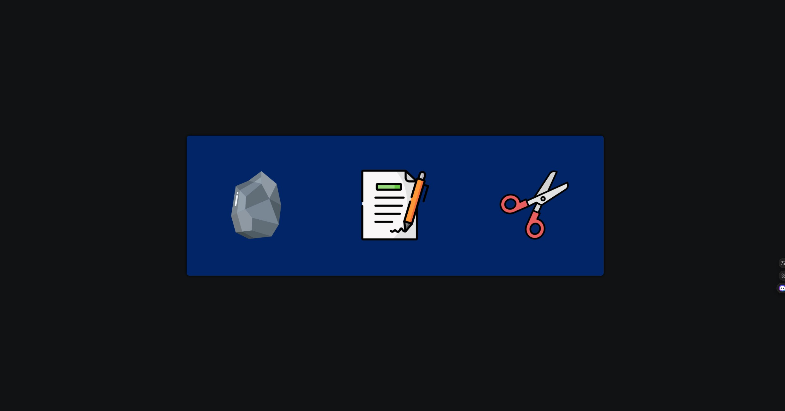
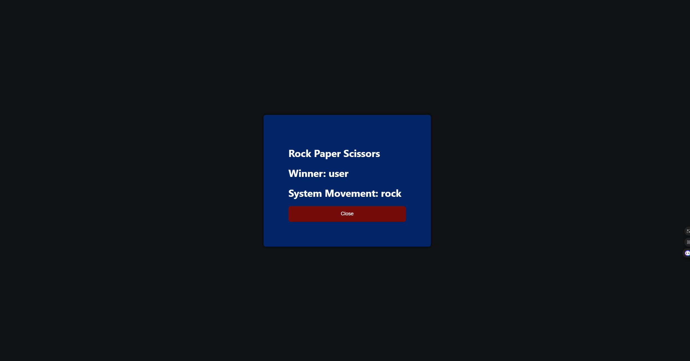
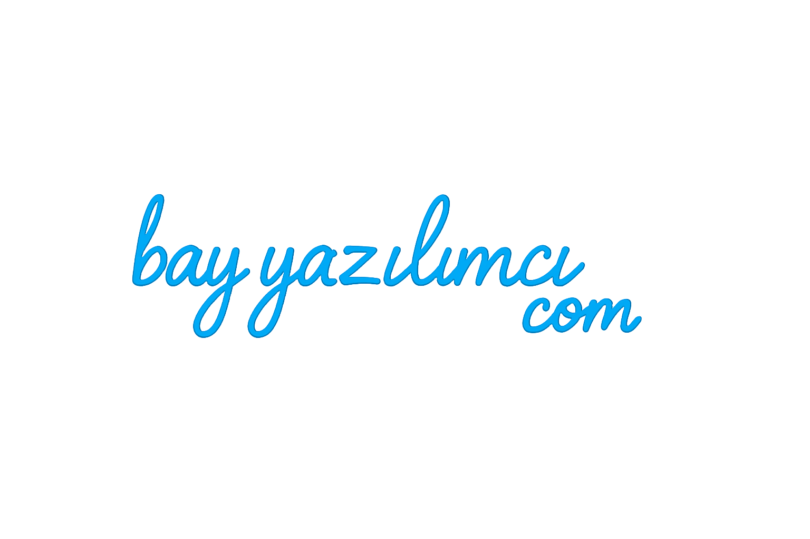

# ✊✋✌️ Rock-Paper-Scissors
<h1>🎯 Amaç:</h1>
Bu projeyi, React kullanarak kendimi yeniden geliştirmek ve zamanla unuttuğum bazı temel kavramları pekiştirmek için oluşturdum.
<h1>🧠 Proje Algoritması:</h1>
<ul>
<li>Kullanıcı "taş", "kağıt" veya "makas" düğmelerinden birine bastığında, sistem rastgele bir hamle seçer.</li>

<li>Eğer sistemin seçtiği hamle, kullanıcınınkiyle aynıysa sonuç beraberlik (draw) olarak belirlenir.</li>

<li>Kullanıcı "taş" seçtiyse ve sistem "makas" seçtiyse kullanıcı kazanır, aksi durumda sistem kazanır.</li>

<li>Kullanıcı "kağıt" seçtiyse ve sistem "taş" seçtiyse kullanıcı kazanır, aksi durumda sistem kazanır.</li>

<li>Kullanıcı "makas" seçtiyse ve sistem "kağıt" seçtiyse kullanıcı kazanır, aksi durumda sistem kazanır.</li>

<li>Sonuç belirlendikten sonra bir pop-up açılır ve kazanan ekranda gösterilir.</li></ul>
<h1>🛠 Kullanılan Teknolojiler</h1>

**İstemci:** React, JavaScript

## 🖼️ Ekran Görüntüleri




  
<h1>💻 Bilgisayarınızda Çalıştırın</h1>

Projeyi klonlayın

```bash
  git clone https://github.com/MustafaYildiz05/Rock-Paper-Scissors
```

Proje dizinine gidin

```bash
  cd my-project
```

Gerekli paketleri yükleyin

```bash
  npm install
```

Sunucuyu çalıştırın

```bash
  npm run start
```



